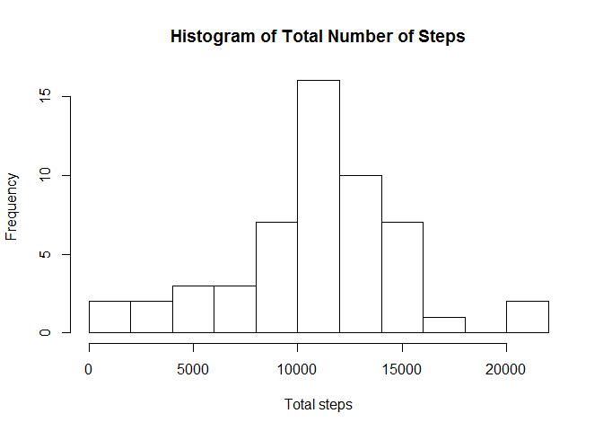
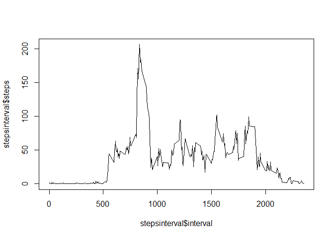
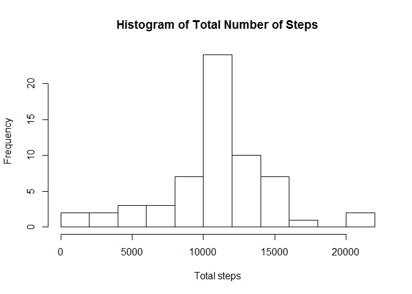

# Reproducible Research: Peer Assessment 1


## Loading and preprocessing the data

```r
if( file.exists('activity.zip') ) {
    unzip('activity.zip')
    activity <- read.csv('activity.csv')
    # transform activity$date to a POSIXct variable
    activity$date <- as.Date(activity$date, "%Y-%m-%d")
} else {
    stop('file activity.zip not found')
}
```

## What is mean total number of steps taken per day?


```r
# calculate total of steps variable grouped by date

stepsday <- aggregate(steps ~ date, activity, sum, na.action = na.pass)

# generate a histogram of the total steps / day

hist(stepsday$steps,breaks=15,xlab="Total steps", 
     main = "Histogram of Total Number of Steps")
```



```r
# calculate the mean and median of the total steps / day

mean(stepsday$steps,na.rm=TRUE)
```

```
## [1] 10766.19
```

```r
median(stepsday$steps,na.rm=TRUE)
```

```
## [1] 10765
```

## What is the average daily activity pattern?


```r
# calculate the average number of steps per interval

stepsinterval <- aggregate(steps ~ interval, activity, mean, na.action = na.omit)

# plot the average number of steps per interval

plot(stepsinterval$interval,stepsinterval$steps,type="l",pch=20)
```



```r
# calculate which 5 minute interval of the number of steps averaged across all days
# is the greatest number of steps

stepsinterval$interval[which.max(stepsinterval$steps)]
```

```
## [1] 835
```

The 5 minute interval from 8:35 - 8:40 contains the maximum number of steps

## Imputing missing values


```r
# calculate and report the total number of missing values in the dataset

sum(is.na(activity$steps))
```

```
## [1] 2304
```

```r
# create a new data.frame with each NA value for the steps variable replaced with the
# average number of steps for the interval of that NA value

activity_new <- activity
for ( index in which(is.na(activity_new$steps))) {
    activity_new$steps[index] <-
        stepsinterval$steps[which(stepsinterval$interval==activity_new$interval[index])]
}

# calculate total of steps variable grouped by date

stepsday_new <- aggregate(steps ~ date, activity_new, sum)

# generate a histogram of the total steps / day

hist(stepsday_new$steps,breaks=15,xlab="Total steps", 
     main = "Histogram of Total Number of Steps")
```



```r
# calculate the mean and median of the total steps / day

mean(stepsday_new$steps)
```

```
## [1] 10766.19
```

```r
median(stepsday_new$steps)
```

```
## [1] 10766.19
```

* The mean number of steps per day does not change with NA's replaced by averages/interval
* The median number of steps per day changes by 1.19 steps  
* When NA's are replaced by average number of steps per interval, the effect is to increase
the number of steps / day in the vicinity of the average (=10766.19)

## Are there differences in activity patterns between weekdays and weekends?


```r
# create a factor variable for weekend vs. weekday

activity_new$dtype <- factor(weekdays(activity_new$date) %in% c("Saturday","Sunday"),
                             labels=c("Weekday","Weekend"))

library(lattice)
```

```
## Warning: package 'lattice' was built under R version 3.1.3
```

```r
# calculate the average number of steps grouped by interval and dtype

stepsinterval_new <- aggregate(steps ~ interval+dtype,activity_new,mean)

# generate a panel plot of the average number of steps taken for weekdays and weekends

xyplot(steps~interval|dtype,stepsinterval_new,type='l',layout=c(1,2),
       xlab="Interval",ylab="Number of Steps")
```


